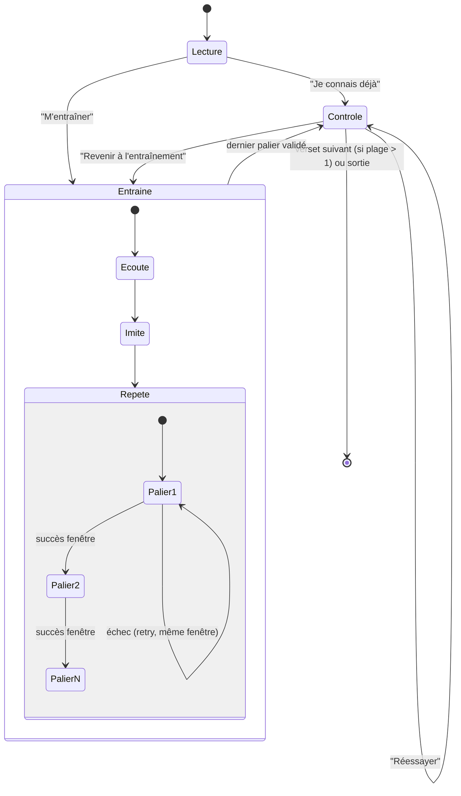

# Comment marche le Coach mémorisation par verset (état au 2026-08-01)

Explique le fonctionnement RÉEL de `CoachScreen` (`app/lib/screens/coach_screen.dart`,
1834 lignes) — l'écran qui fait travailler un verset (ou une plage de versets,
un par un) en 3 modes : **Lecture → Entraîne → Contrôle**. Écrit après lecture
complète du code, pas d'après une intention ou une spec ancienne.

Ne pas confondre avec le **jeu QCM** (`memorization_game_screen.dart`, révélation
progressive mot par mot avec 3 leurres) — c'est un écran différent, atteignable
séparément depuis le hub Coach zone B‑bis. Ce document ne couvre que le
Coach à 3 modes.

---

## 1. Où on arrive dessus

`CoachScreen` reçoit une **liste de versets** (`List<Verse> verses`) au moment
où on le pousse — jamais construit ailleurs que par un `Navigator.push`. Points
d'entrée réels :

| D'où | Quels versets |
|---|---|
| Hub Coach, zone A « Reprendre » | le dernier verset travaillé (mémorisé par `lastCoachVerseProvider`) |
| Hub Coach, zone B « Mémoriser » | la plage choisie via `SurahPickerScreen` |
| Hub Coach, zone D, bouton « Revoir » sur un verset fauté | ce seul verset |
| Lecture Mushaf, bouton discret « Mémoriser » | le verset affiché |

Dès l'ouverture (`initState`, ligne 37‑58), l'écran enregistre ce verset comme
« dernier travaillé » via `recordLastCoachVerse(...)` — c'est ce qui alimente
la carte « Reprendre » du hub. Ça arrive **à chaque ouverture**, pas seulement
à la fin d'une session (donc même si tu quittes tout de suite après avoir
ouvert l'écran, ce verset devient le nouveau « dernier travaillé »).

---

## 2. La structure de l'écran

```
┌─────────────────────────────────────┐
│ Header : ← retour | titre du verset  │  icône ✨ = réglages de vérification
│                          (tajwid/adulte/enfant, règles) → TajwidRulesScreen
├─────────────────────────────────────┤
│ [◀ 3/12 ▶]  (barre de nav verset,     │  visible seulement si plusieurs versets
│              seulement si plage>1)   │
├─────────────────────────────────────┤
│ ○ Lecture ─○─ Entraîne ─○─ Contrôle  │  StepBar : tap = changer de mode direct
├─────────────────────────────────────┤
│                                       │
│         (le mode courant)            │  ← swipe horizontal = verset suivant/
│                                       │    précédent (si plage > 1 verset)
└─────────────────────────────────────┘
```

Point clé : **un seul verset à la fois est réellement travaillé**
(`session.currentVerse`), même si on t'a donné toute une sourate. Les 3 modes
ne portent jamais sur plusieurs versets concaténés — ce comportement date du
2026-07-24 (avant cette date, tous les versets étaient collés en un seul bloc
de texte). Passer au verset suivant (flèche, ou swipe) **réinitialise tout** :
mode, étape, scores — chaque verset est une passe indépendante
(`CoachSessionState.withVerseIndex`, `coach_session.dart:98-101`).

La `StepBar` n'est **pas verrouillée** : tu peux taper directement sur
« Contrôle » sans être passé par Lecture/Entraîne (utile si tu penses déjà
connaître le verset).

---

## 3. Mode 1 — Lecture

But : établir un **score de référence** (`baselineAccuracy`) — à quel point tu
lis bien ce verset **en le voyant**, avant tout entraînement.

1. Le texte du verset s'affiche normalement.
2. Tu tapes le micro, tu lis le verset à voix haute (le texte reste affiché,
   ce n'est PAS un test de mémoire).
3. Le moteur ASR (FastConformer — voir §7) transcrit et compare mot à mot ;
   les mots se colorent (vert/orange/rouge) au fur et à mesure.
4. Une fois fini (`RecitationStatus.finished`), le score `accuracy` est
   sauvegardé comme `baselineAccuracy` (ligne 421-431) — **une seule fois**
   par verset (`if (finished && coach.baselineAccuracy == null)`), retaper le
   micro après ne le réécrase pas.
5. **Empreinte vocale** : SI ce score est ≥ 60 %, l'audio de cette lecture est
   sauvegardé comme référence de ta voix pour CE verset précis
   (`VoiceFingerprintService.saveReference`, comparaison DTW sur embeddings —
   sert plus tard en Contrôle, §5). En dessous de 60 %, rien n'est gardé : une
   lecture pleine de fautes ne doit pas devenir la référence de « à quoi
   ressemble ta voix sur ce verset ».
6. Deux boutons apparaissent : **« Je connais déjà »** (saute direct en
   Contrôle) ou **« M'entraîner »** (va en mode 2).

---

## 4. Mode 2 — Entraîne (3 sous-étapes)

Sous-barre à part (`_AppSubStepBar`) : **Écoute → Imite → Répète**. Contraire
à la `StepBar` principale, ici tu ne peux avancer qu'en séquence (`if (i <=
step) coach.setAppStep(i)` — sauter en avant est bloqué, revenir en arrière
est libre).

### 4.1 Écoute
Lecture audio simple du récitateur choisi (`playerProvider`), aucun micro,
aucun jugement. Le bouton « Continuer vers l'imitation » n'apparaît qu'une
fois que tu as lancé l'audio au moins une fois (`_audioStarted`).

### 4.2 Imite
Même chose, mais tu es censé réciter EN MÊME TEMPS que l'audio (« Imite en
même temps » / « Lance et imite »). **Aucune vérification n'a lieu ici** — pas
de micro jugé, c'est un exercice de calage libre, purement pédagogique.

### 4.3 Répète — le vrai moteur d'apprentissage
C'est ici que vit toute la logique de progression par palier
(`IncrementalRepeatStep`, `coach_incremental_repeat.dart`), déléguée à un
widget séparé. Mécanisme précis :

- Le verset est découpé en **unités** : 1 mot par unité en preset Enfant,
  sinon un nombre de mots réglable (`adultChunkWordCountProvider`, défaut
  **6** mots, réglable 1-15) qui approxime une ligne de Mushaf.
- Une **fenêtre glissante de taille fixe** (`repeatWindowSizeProvider`,
  défaut **2** unités, réglable 1-6) définit ce qu'il faut réciter d'un coup.
  Exemple avec fenêtre=2 :
  - Palier 1 : réciter l'unité 1 seule.
  - Palier 2 : réciter {unité 1, unité 2} ensemble.
  - Palier 3 : réciter {unité 2, unité 3} ensemble (la fenêtre **glisse**,
    elle ne s'agrandit jamais — tu ne récites jamais plus de `windowSize`
    unités à la fois, même en fin de long verset).
- À chaque palier : l'audio de la fenêtre est rejoué (`WordCorrectionAudio.
  playWordWindow`, timings réels quran.com), puis le micro s'active tout seul
  et écoute.
- **Critère de réussite d'un palier** : tous les mots de la fenêtre doivent
  être `correct` ou `unclear` (jamais `error`/`skipped`). Si oui → palier
  suivant automatiquement (nouvel audio + nouvelle écoute). Si non → l'écran
  secoue visuellement (shake), **la fenêtre ne recule pas**, tu retapes le
  micro pour retenter la MÊME fenêtre (pas de dégradation progressive, pas de
  malus).
- Une fois **toutes** les unités du verset validées : verset suivant
  automatique (si ce n'est pas le dernier de la plage) ou passage direct en
  mode **Contrôle** (si c'était le dernier verset).

⚠️ **Bug connu, non corrigé à ce jour** : après avoir récité un palier, l'écran
peut rester bloqué indéfiniment sur le spinner « Analyse … en cours » (visible
sur capture d'écran le 2026-08-01) — la validation du palier ne se déclenche
jamais alors que la transcription s'est bien terminée en coulisses. Cause
identifiée : une variable d'état interne (`_phase`) passe à `processing` avant
que l'app ne détecte la fin de la transcription, et le code qui détecte la fin
exige justement que cette variable soit encore à `listening` — elle ne l'est
plus, donc rien ne se passe. Correctif proposé mais **pas encore appliqué**
(en attente de validation) : cf. discussion de session, à reporter dans
`PLAN_CORRECTION_IHM.md` si non encore fait.

---

## 5. Mode 3 — Contrôle

But : mesurer si tu récites **sans voir le texte** (vraie mémorisation, pas de
la lecture).

1. Le verset est affiché **flouté** (`_BlurredVerse`) — tu ne peux rien lire.
2. Tu tapes le micro et récites de mémoire.
3. Une fois fini : le texte se révèle avec la coloration mot à mot (comme en
   Lecture), le score devient `controlAccuracy` (une seule sauvegarde par
   passage, comme en Lecture).
4. **Empreinte vocale** : si une référence existait (établie en Lecture, §3),
   l'audio de ce Contrôle est comparé à elle (`compareToReference`, score DTW
   affiché en badge) — sert à repérer si c'est bien TOI qui récites (pas un
   signal de justesse du texte, un signal d'identité vocale).
5. **Le score qui compte vraiment** : `memorizationGap = controlAccuracy −
   baselineAccuracy` (`coach_session.dart:41-44`). Positif = tu récites MIEUX
   de mémoire qu'en lisant (signe que tu l'as vraiment appris, pas juste
   déchiffré). `isMemorized` devient vrai si ce gap est **≥ 5 points**
   (`coach_session.dart:46`, seuil dupliqué dans l'UI `_GapCard` ligne 1657).
   S'affiche seulement si un `baselineAccuracy` existe (donc si tu as
   commencé par Contrôle directement sans passer par Lecture, pas de
   comparaison possible, juste le score brut).
6. Deux boutons en sortie : **Réessayer** (relance Contrôle depuis zéro) ou
   **Revenir à l'entraînement** (retour mode 2, palier repart de zéro aussi
   — aucune mémoire du palier atteint n'est gardée entre deux passages en
   mode 2, cf. §6).

---

## 6. Ce qui est mémorisé entre deux sessions — et ce qui ne l'est PAS

| Donnée | Persistée ? | Où |
|---|---|---|
| Dernier verset ouvert (sourate + numéro) | ✅ oui | `SharedPreferences` via `lastCoachVerseProvider` |
| `baselineAccuracy` / `controlAccuracy` / palier atteint en Répète | ❌ non | `coachProvider` est `autoDispose` — tout disparaît en quittant l'écran |
| Empreinte vocale de référence (Lecture, si score ≥ 60 %) | ✅ oui | `VoiceFingerprintService`, par `passageKey` (sourate-verset) |
| Erreurs commises | ❌ **jamais alimenté depuis le Coach** | le journal d'erreurs par sourate (zone D du hub) n'est rempli QUE par la récitation globale (`karaoke_recitation_screen.dart`), jamais par `coach_screen.dart` — réciter en Coach ne fait progresser aucune statistique d'erreur affichée ailleurs dans l'app |
| Planification de révision (type FSRS/SM‑2, « quand refaire ce verset ») | ❌ **n'existe pas** | un commentaire dans le code (`last_coach_verse_provider.dart:13`) évoque FSRS mais aucune logique de ce type n'est implémentée — pas de date de prochaine révision, pas d'intervalle calculé |

Concrètement : rouvrir un verset qu'on a déjà mémorisé repart **de zéro** en
Lecture/Entraîne (nouveau `baselineAccuracy`), seule la position (quel
verset) est retenue.

---

## 7. Le moteur ASR derrière tout ça

Un seul modèle tourne réellement : **FastConformer CTC** (le modèle maison
entraîné sur ce projet). La classe qui l'expose côté app s'appelle
`WhisperOnnxVerifier` (`recitation_provider.dart:112-115`) — nom **historique**
hérité de l'époque où Whisper était le modèle de prod. Son code interne
délègue entièrement à `FastConformerVerifier`
(`services/recitation_verifier.dart:1047-1050`, commentaire explicite : «
whisper.cpp désactivé »). Deux libellés d'IHM affichent encore « Whisper »
sans rapport avec ce qui tourne réellement (à corriger, listé dans
`PLAN_CORRECTION_IHM.md`) :
- Écran À propos : « Propulsé par Gemma 4 + Whisper »
- Spinner de traitement (Lecture/Contrôle/Répète) : « Analyse Whisper en
  cours… »

---

## 8. Schéma récapitulatif


