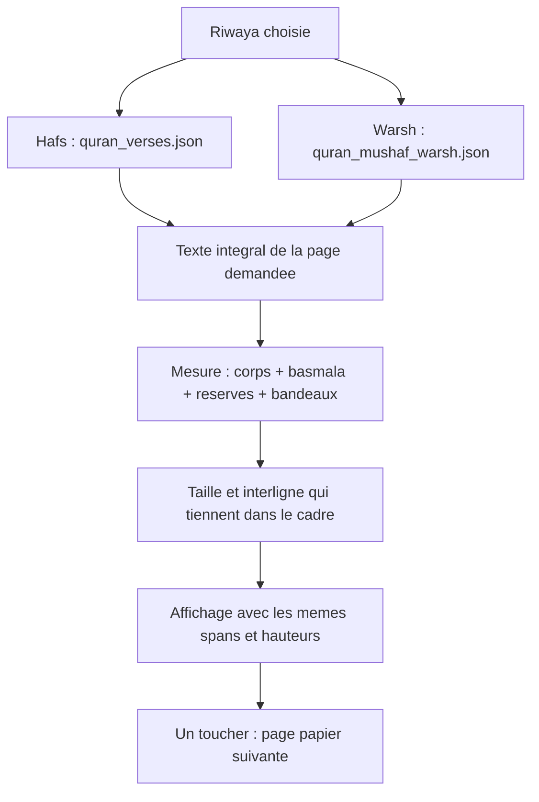

# Mushaf papier : page complete, sans debordement

Auteur : ChGPT (Codex), 2026-09-09.
Point de retour avant edition : `cabc45e` (ecran papier identique a HEAD).
Les modifications preexistantes des autres ecrans, traductions et ASR sont
laissees intactes. Ce point de retour ne les inclut pas.

## Demande et constat

Conserver les memes pages que le Mushaf papier : aucun mot reporte sur la page
suivante, aucune derniere ligne masquee. Conserver l'ecriture choisie.

Captures initiales sur SM-S931B, 1080 x 2340, densite Android 510 :
- Page 574 : bande Flutter `BOTTOM OVERFLOWED BY 1.7 PIXELS`.
- Page 573 : fin du verset 72:28 coupee en bas du cadre.
- Le test widget initial reproduit aussi un debordement de 5,7 pixels sur la
  page 604 en Amiri, avec plusieurs sourates sur la meme page.

## Causes et correction

Dans `app/lib/screens/mushaf_maquette_screen.dart` :

1. La recherche initiale mesurait seulement le paragraphe, avec un traitement
   du premier ascender different de celui du rendu. Elle ne comptait pas
   toute la hauteur de la basmala separee.
2. La verification finale utilisait une seconde formule ; le rendu ajoutait
   encore `taille * 0.18` par segment APRES cette verification. La somme des
   boites pouvait donc depasser la place disponible.
3. `Text.rich` pouvait heriter de parametres Material absents du `TextPainter`.
4. Les `ClipRect` masquaient le texte depassant sans garantir sa presence
   visuelle. La disparition de la bande jaune n'aurait donc pas suffi.

La recherche de taille et celle d'interligne utilisent maintenant la MEME
mesure complete : corps, basmala et reserve des diacritiques. Les bandeaux
sont deduits de la hauteur disponible. Les hauteurs retenues sont celles des
boites affichees, sans marge ajoutee apres coup.

Le corps est un `RichText` utilisant le meme constructeur de spans que le
`TextPainter`. La basmala garde son centrage, sa hauteur est mesuree avec son
propre span. Le corps n'est plus comprime dans un `Flexible` sous la basmala.
Le cache des reserves est invalide lorsqu'une police finit de charger.
Les `TextPainter` de mesure sont liberes apres usage.

## Perimetre preserve

- Aucun texte, asset coranique, indice de page ou numero de verset modifie.
- Warsh conserve sa pagination papier, distincte de son index audio/ASR.
- Aucun changement d'alignement, normalisation, GOP, modele ou capture audio.
- Les branches Hafs/Warsh existantes des signes de waqf restent inchangees.
- Aucun JPEG de page, nouvelle police, dependance ou image ajoute a l'APK.
- Le rendu ligne par ligne precedemment refuse reste debranche. Les mots
  restent sur leur page papier ; les retours a la ligne dependent encore de
  l'ecriture et de l'ecran. Ce n'est pas un fac-simile ligne par ligne.

## Verification

`flutter test --no-pub test/mushaf_page_layout_test.dart` : **29 tests passent**.
Les tests utilisent les vrais assets et les polices locales Amiri / Bouazzi.
Pages rendues pour chaque riwaya : 1, 2, 3, 77, 106, 562, 573, 574, 586,
590, 604. Verifications supplementaires : rotation paysage, petit ecran,
monochrome sombre, toucher pour avancer d'une page.

Les tests controlent chaque verset complet dans l'ordre, la hauteur naturelle
des paragraphes, leurs limites par rapport aux clips et au pied de page.
Les bornes et le texte des **604 pages de chaque riwaya** sont compares aux
assets correspondants. Cela ne signifie pas que les 1208 pages ont toutes
fait l'objet d'une capture ou d'une validation visuelle.

Analyse Dart ciblee : aucune erreur, deux avertissements preexistants de code
inutilise (`_kBoiteBasmala`, `_pageLignes`, conserves avec leur historique).
Build Android debug reussi. Version : `v395-chgpt-mushaf-page-entiere`,
`BUILD_TS=2026-09-09-ChGPT-mushaf`. Installation DEV par `adb install -r`
reussie, sans desinstallation ni effacement des donnees.

Verification visuelle apres installation, ecriture courante Noto Sans Arabic,
Hafs, sans changement des preferences de lecture :
- `screenshots/chgpt_mushaf_573_corrige.png` : verset 72:28 complet,
  medaillon inclus ; aucun trait de texte coupe par le pied.
- `screenshots/chgpt_mushaf_574_corrige.png` : basmala et versets 73:1..19
  visibles en entier ; aucune bande jaune/noire. Obtenue par un simple
  toucher depuis la page 573, sans saut de page.
- Le journal device confirme a 15:00:54 le tag v395 et le marqueur de build
  ChGPT, puis l'ouverture de la page 573. Aucun nouveau message d'erreur
  n'apparait dans cette sequence du journal.

Limites : la verification visuelle sur appareil porte sur ces deux pages.
Les autres cas sont des tests de widgets et de donnees. Aucun nouveau
benchmark ASR n'est revendique : sa chaine n'a pas ete modifiee ici.
